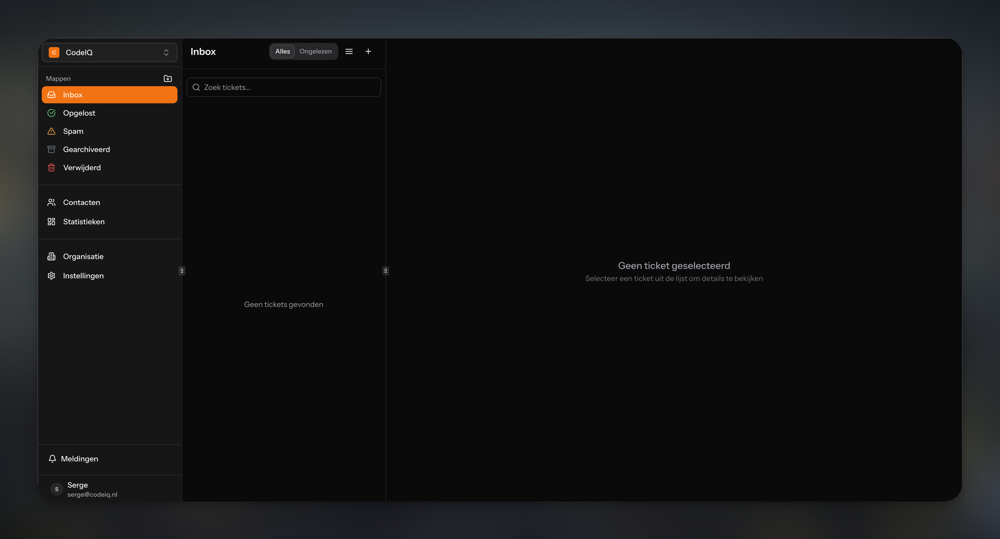

<p align="center">
  
</p>

<h1 align="center">FluxDesk</h1>

<p align="center">
  Open-source customer support software built on Laravel and ShadCN.
</p>

<p align="center">
  
  
  <a href="https://github.com/FluxDesk/FluxDesk/blob/main/LICENSE"></a>
</p>

---

## Features

- **Multi-tenant** — Run multiple organizations from one installation
- **Microsoft 365 & Google Workspace** — Native OAuth integration, no IMAP hacks
- **Real threading** — Conversations stay together like they should
- **Customer portal** — Self-service for customers to submit and track tickets
- **Familiar UI** — If you've used Outlook, you already know how to use this

---

## Quick Start

```bash
git clone https://github.com/FluxDesk/FluxDesk.git
cd FluxDesk
composer install
npm install && npm run build
php artisan serve
```

Visit `http://localhost:8000` — the installation wizard takes it from there.

---

## Requirements

- PHP 8.2+
- Node.js 18+
- SQLite, MySQL 8.0+, or PostgreSQL 13+

---

## Questions & Ideas

Head over to the [Discussions](https://github.com/FluxDesk/FluxDesk/discussions) tab.

---

## License

MIT License. See [LICENSE](LICENSE) for details.
